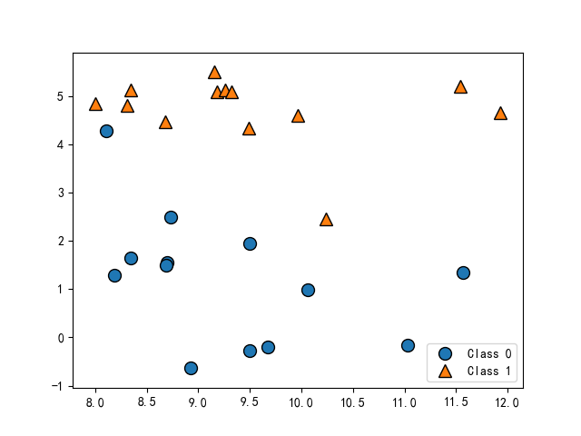

# ch02

## 一些样本数据集
一个模拟的二分类数据集示例是forge 数据集，它有两个特征。下列代码将绘制一个散点，将此数据集的所有数据点可视化。图像以第一个特征为x 轴，第二个特征为y 轴。正如其他散点图那样，每个数据点对应图像中的一点。每个点的颜色和形状对应其类别：
```python
# 分类数据集
X, y = make_forge()
mglearn.discrete_scatter(X[:, 0], X[:, 1], y)
plt.legend(['Class 0', 'Class 1'], loc=4)
plt.savefig("forge.png")
plt.show()
```



我们用模拟的wave 数据集来说明回归算法。wave 数据集只有一个输入特征和一个连续的目标变量（或响应），后者是模型想要预测的对象。下面绘制的图像（图2-3）中单一特征位于x 轴，回归目标（输出）位于y 轴：

```python
# 回归数据集
X, y = make_wave()  # X.shape(100, 1)
plt.plot(X, y, "o")
plt.ylim(-3, 3)
plt.xlabel("Feature")
plt.ylabel("Target")
plt.savefig("wave.png")
plt.show()
```


除了上面这些小型的模拟的数据集，我们还将补充两个现实世界中的数据集，它们都包含在scikit-learn 中。其中一个是威斯康星州乳腺癌数据集（简称cancer），里面记录了乳腺癌肿瘤的临床测量数据。每个肿瘤都被标记为“良性”（benign，表示无害肿瘤）或“恶性”（malignant，表示癌性肿瘤），其任务是基于人体组织的测量数据来学习预测肿瘤是否为恶性。
```python
# cancer数据集
cancer = load_breast_cancer()
print("key of cancer:\n{}".format(cancer.keys()))
# dict_keys(['data', 'target', 'frame', 'target_names', 'DESCR', 'feature_names', 'filename'])
print("shape of data:{}".format(cancer.data.shape))# shape of data:(569, 30)
print("sample counts per class:\n{}".format({n: v for n, v in zip(cancer.target_names, np.bincount(cancer.target))}))# {'malignant': 212, 'benign': 357}
print("feature names:\n{}".format(cancer.feature_names))#  30个
```

我们还会用到一个现实世界中的回归数据集，即波士顿房价数据集。与这个数据集相关的任务是，利用犯罪率、是否邻近查尔斯河、公路可达性等信息，来预测20 世纪70 年代波士顿地区房屋价格的中位数。这个数据集包含506 个数据点和13 个特征：

```python
# boston
boston = load_boston()
print("data shape: {}".format(boston.data.shape))  # data shape: (506, 13)

X, y = load_extended_boston()
# 最初的13个特征加上这13个特征两两组合（有放回）得到的91个特征，一共有104个特征
print("X.shape: {}".format(X.shape))  # X.shape: (506, 104)
```

## K近邻

构建模型只需要保存训练数据集即可。想要对新数据点做出预测，算法会在训练数据集中找到最近的数据点，也就是它的“最近邻”。

### k近邻分类
k-NN 算法最简单的版本只考虑一个最近邻，也就是与我们想要预测的数据点最近的训练数据点。预测结果就是这个训练数据点的已知输出。图给出了这种分类方法在forge数据集上的应用：

```python
plot_knn_classification(n_neighbors=1)
plt.savefig("plot_knn_classification_2.png")
plt.show()
```


这里我们添加了3个新数据点（用五角星表示）。对于每个新数据点，我们标记了训练集中与它最近的点。单一最近邻算法的预测结果就是那个点的标签（对应五角星的颜色）。

除了仅考虑最近邻，我还可以考虑任意个（k 个）邻居。这也是k 近邻算法名字的来历。在考虑多于一个邻居的情况时，我们用“投票法”（voting）来指定标签。也就是说，对于每个测试点，我们数一数多少个邻居属于类别0，多少个邻居属于类别1。然后将出现次数更多的类别（也就是k 个近邻中占多数的类别）作为预测结果。下面的例子用到了3 个近邻。

```python
plot_knn_classification(n_neighbors=3)
plt.savefig("plot_knn_classification_3.png")
plt.show()
```


和上面一样，预测结果可以从五角星的颜色看出。你可以发现，左上角新数据点的预测结果与只用一个邻居时的预测结果不同。虽然这张图对应的是一个二分类问题，但方法同样适用于多分类的数据集。对于多分类问题，我们数一数每个类别分别有多少个邻居，然后将最常见的类别作为预测结果。


```python
X, y = make_forge()
X_train, X_test, y_train, y_test = train_test_split(X, y)
clf = KNeighborsClassifier(n_neighbors=3)
clf.fit(X_train, y_train)

print("test set predictions: {}".format(clf.predict(X_test)))  # test set predictions: [0 1 0 1 0 0 1]
print("test set accuracy: {:.2f}".format(clf.score(X_test, y_test)))  # test set accuracy: 1.00
```

#### 分析KNeighborsClassifier
对于二维数据集，我们还可以在xy 平面上画出所有可能的测试点的预测结果。我们根据平面中每个点所属的类别对平面进行着色。这样可以查看决策边界（decision boundary），即算法对类别0 和类别1 的分界线。

```python
# 分析KNeighborsClassifier
fig, axes = plt.subplots(1, 3, figsize=(10, 3))
for n_neighbors, ax in zip([1, 3, 9], axes):
    # fit方法返回对象本身，所以我们可以将实例化和拟合放在一行代码中
    clf = KNeighborsClassifier(n_neighbors=n_neighbors).fit(X, y)
    mglearn.plots.plot_2d_separator(clf, X, fill=True, eps=0.5, ax=ax, alpha=.4)
    mglearn.discrete_scatter(X[:, 0], X[:, 1], y, ax=ax)
    ax.set_title("{} neighbor(s)".format(n_neighbors))
    ax.set_xlabel("feature 0")
    ax.set_ylabel("feature 1")
axes[0].legend(loc=3)
plt.savefig("KNeighborsClassifier.png")
plt.show()
```


随着邻居个数越来越多，决策边界也越来越平滑。更平滑的边界对应更简单的模型。换句话说，使用更少的邻居对应更高的模型复杂度（如图2-1 右侧所示），而使用更多的邻居对应更低的模型复杂度（如图2-1 左侧所示）。假如考虑极端情况，即邻居个数等于训练集中所有数据点的个数，那么每个测试点的邻居都完全相同（即所有训练点），所有预测结果也完全相同（即训练集中出现次数最多的类别）。

我们来研究一下能否证实之前讨论过的模型复杂度和泛化能力之间的关系。我们将在现实世界的乳腺癌数据集上进行研究。先将数据集分成训练集和测试集，然后用不同的邻居个数对训练集和测试集的性能进行评估。输出结果见图：

```python
cancer = load_breast_cancer()

X_train, X_test, y_train, y_test = train_test_split(cancer.data, cancer.target, stratify=cancer.target, random_state=66)
training_accuracy = []
test_accuracy = []

# n_neighbors取值从1到100
neighbors_settings = range(1, 100)
for n_neighbors in neighbors_settings:
    # 构建模型
    clf = KNeighborsClassifier(n_neighbors=n_neighbors)
    clf.fit(X_train, y_train)
    # 记录训练集精度
    training_accuracy.append(clf.score(X_train, y_train))
    # 记录泛化精度
    test_accuracy.append(clf.score(X_test, y_test))
    
plt.plot(neighbors_settings, training_accuracy, label="training accuracy")
plt.plot(neighbors_settings, test_accuracy, label="test accuracy")
plt.ylabel("Accuracy")
plt.xlabel("n_neighbors")
plt.legend()
plt.savefig("KNeighborsClassifier_cancer.png")
plt.show()
```

图像的x 轴是n_neighbors，y轴是训练集精度和测试集精度。虽然现实世界的图像很少有非常平滑的，但我们仍可以看出过拟合与欠拟合的一些特征。仅考虑单一近邻时，训练集上的预测结果十分完美。但随着邻居个数的增多，模型变得更简单，训练集精度也随之下降。单一邻居时的测试集精度比使用更多邻居时要低，这表示单一近邻的模型过于复杂。与之相反，当考虑100 个邻居时，模型又过于简单，性能甚至变得更差。最佳性能在中间的某处，邻居个数大约为6。不过最好记住这张图的坐标轴刻度。最差的性能约为88% 的精度，这个结果仍然可以接受。
### k近邻回归
k 近邻算法还可以用于回归。我们还是先从单一近邻开始，这次使用wave 数据集。我们添加了3 个测试数据点，在x 轴上用绿色五角星表示。利用单一邻居的预测结果就是最近邻的目标值。

```python
plot_knn_regression(n_neighbors=1)
plt.savefig("plot_knn_regression_1.png")
plt.show()
```


同样，也可以用多个近邻进行回归。在使用多个近邻时，预测结果为这些邻居的平均值

```python
plot_knn_regression(n_neighbors=3)
plt.savefig("plot_knn_regression_3.png")
plt.show()
```


```python
X, y = make_wave(40)
X_train, X_test, y_train, y_test = train_test_split(X, y)
reg = KNeighborsRegressor(n_neighbors=3)
reg.fit(X_train, y_train)
print("test set predictions: \n{}".format(reg.predict(X_test)))
'''
[ 1.35804903 -0.55985738  0.86954488  1.27642323 -1.74816387  1.41843267
 -0.90441436  0.89609343  0.00297044 -1.26241359 -1.32225646 -0.78269398
  0.86954488 -0.66774248 -0.56715615 -1.49001759  0.86954488 -1.49001759
 -0.74969529  0.19425431 -0.81050346 -0.37311844 -1.49001759  0.85083228
  1.55516634]
'''
print("test set R^2: {:.2f}".format(reg.score(X_test, y_test)))# test set R^2: 0.70
```

我们还可以用score 方法来评估模型，对于回归问题，这一方法返回的是R2 分数。R2 分数也叫作决定系数，是回归模型预测的优度度量，位于0 到1 之间。R2 等于1 对应完美预测，R2 等于0 对应常数模型，即总是预测训练集响应（y_train）的平均值：
这里的分数是0.0.70，表示模型的拟合相对较好。

#### 分析KNeighborsRegressor

对于我们的一维数据集，可以查看所有特征取值对应的预测结果。为了便于绘图，我们创建一个由许多点组成的测试数据集：

```python
fig, axes = plt.subplots(1, 3, figsize=(15, 4))
# 创建1000个数据点，在-3和3之间均匀分布
line = np.linspace(-3, 3, 1000).reshape(-1, 1)

for n_neighbors, ax in zip([1, 3, 9], axes):
    # 利用1个、3个或9个邻居分别进行预测
    reg = KNeighborsRegressor(n_neighbors=n_neighbors)
    reg.fit(X_train, y_train)
    ax.plot(line, reg.predict(line))
    ax.plot(X_train, y_train, '^', c=mglearn.cm2(0), markersize=8)
    ax.plot(X_test, y_test, 'v', c=mglearn.cm2(1), markersize=8)
    ax.set_title(
    "{} neighbor(s)\n train score: {:.2f} test score: {:.2f}".format(
    n_neighbors, reg.score(X_train, y_train),
    reg.score(X_test, y_test)))
    ax.set_xlabel("Feature")
    ax.set_ylabel("Target")
axes[0].legend(["Model predictions", "Training data/target",
"Test data/target"], loc="best")
plt.savefig("KNeighborsRegressor.png")
plt.show()
```


从图中可以看出，仅使用单一邻居，训练集中的每个点都对预测结果有显著影响，预测结果的图像经过所有数据点。这导致预测结果非常不稳定。考虑更多的邻居之后，预测结果变得更加平滑，但对训练数据的拟合也不好。

### 优点、缺点和参数
一般来说，KNeighbors 分类器有2个重要参数：邻居个数与数据点之间距离的度量方法。在实践中，使用较小的邻居个数（比如3 个或5 个）往往可以得到比较好的结果，但你应该调节这个参数。选择合适的距离度量方法超出了本书的范围。默认使用欧式距离，它在
许多情况下的效果都很好。

k-NN 的优点之一就是模型很容易理解，通常不需要过多调节就可以得到不错的性能。在考虑使用更高级的技术之前，尝试此算法是一种很好的基准方法。构建最近邻模型的速度通常很快，但如果训练集很大（特征数很多或者样本数很大），预测速度可能会比较慢。使用k-NN 算法时，对数据进行预处理是很重要的（见第3 章）。这一算法对于有很多特征（几百或更多）的数据集往往效果不好，对于大多数特征的大多数取值都为0 的数据集（所谓的稀疏数据集）来说，这一算法的效果尤其不好。

虽然k 近邻算法很容易理解，但由于预测速度慢且不能处理具有很多特征的数据集，所以在实践中往往不会用到。


## 线性模型
线性模型是在实践中广泛使用的一类模型，几十年来被广泛研究，它可以追溯到一百多年前。线性模型利用输入特征的线性函数（linear function）进行预测，稍后会对此进行解释。

### 用于回归的线性模型

对于回归问题，线性模型预测的一般公式如下：
$$
ŷ =w[0]*x[0]+w[1]*x[1]+w[2]*x[2]...+w[p]*x[p]+b
$$
这里x[0] 到x[p] 表示单个数据点的特征（本例中特征个数为p+1），w 和b 是学习模型的
参数，ŷ 是模型的预测结果。对于单一特征的数据集，公式如下：
$$
ŷ =w[0]*x[0]+b
$$

```python
mglearn.plots.plot_linear_regression_wave()
plt.savefig("plot_linear_regression_wave.png")# w[0]: 0.393906  b: -0.031804
plt.show()
```


#### 线性回归（又名普通最小二乘法）

线性回归，或者普通最小二乘法（ordinary least squares，OLS），是回归问题最简单也最经典的线性方法。线性回归寻找参数w 和b，使得对训练集的预测值与真实的回归目标值y之间的均方误差最小。均方误差（mean squared error）是预测值与真实值之差的平方和除以样本数。线性回归没有参数，这是一个优点，但也因此无法控制模型的复杂度。

```python
X, y = make_wave()
X_train, X_test, y_train, y_test = train_test_split(X, y)

lr = LinearRegression()
lr.fit(X_train, y_train)

print("lr.corf_: {}".format(lr.coef_))  # lr.corf_: [0.46196473]
print("lr.intercept_:{}".format(lr.intercept_))  # lr.intercept_:-0.001525054558320263
print("lr train set accuracy: {:.2f}".format(lr.score(X_train, y_train)))#0.59
print("lr test set accuracy: {:.2f}".format(lr.score(X_test, y_test)))# 0.66
```

R2 约为0.66，这个结果不是很好，但我们可以看到，训练集和测试集上的分数非常接近。这说明可能存在欠拟合，而不是过拟合。对于这个一维数据集来说，过拟合的风险很小，因为模型非常简单（或受限）。然而，对于更高维的数据集（即有大量特征的数据集），线性模型将变得更加强大，过拟合的可能性也会变大。我们来看一下LinearRegression 在更复杂的数据集上的表现，比如波士顿房价数据集。记住，这个数据集有506 个样本和105个导出特征。

```python
 X, y = load_extended_boston()
 X_train, X_test, y_train, y_test = train_test_split(X, y)
 
 lr = LinearRegression()
 lr.fit(X_train, y_train)
 
 print("lr.corf_: {}".format(lr.coef_))  # lr.corf_.shape: (104,)
 print("lr.intercept_:{}".format(lr.intercept_))# -15.374975350438117
 print("lr train set accuracy: {:.2f}".format(lr.score(X_train, y_train)))# 0.93
 print("lr test set accuracy: {:.2f}".format(lr.score(X_test, y_test)))# 0.82
```

#### 岭回归

岭回归也是一种用于回归的线性模型，因此它的预测公式与普通最小二乘法相同。但在岭回归中，对系数（w）的选择不仅要在训练数据上得到好的预测结果，而且还要拟合附加约束。我们还希望系数尽量小。换句话说，w 的所有元素都应接近于0。直观上来看，这意味着每个特征对输出的影响应尽可能小（即斜率很小），同时仍给出很好的预测结果。这种约束是所谓正则化（regularization）的一个例子。正则化是指对模型做显式约束，以避免过拟合。岭回归用到的这种被称为L2 正则化。

```python
X, y = load_extended_boston()
X_train, X_test, y_train, y_test = train_test_split(X, y)

ridge = Ridge()

print("ridge.corf_: {}".format(ridge.coef_))
print("ridge.intercept_:{}".format(ridge.intercept_))# 21.464924346897
print("ridge train set accuracy: {:.2f}".format(ridge.score(X_train, y_train)))# 0.85
print("ridge test set accuracy: {:.2f}".format(ridge.score(X_test, y_test)))# 0.88
```

可以看出，Ridge 在训练集上的分数要低于LinearRegression，但在测试集上的分数更高。这和我们的预期一致。线性回归对数据存在过拟合。Ridge 是一种约束更强的模型，所以更不容易过拟合。复杂度更小的模型意味着在训练集上的性能更差，但泛化性能更好。由于我们只对泛化性能感兴趣，所以应该选择Ridge 模型而不是LinearRegression 模型。

Ridge 模型在模型的简单性（系数都接近于0）与训练集性能之间做出权衡。简单性和训练集性能二者对于模型的重要程度可以由用户通过设置alpha 参数来指定。在前面的例子中，我们用的是默认参数alpha=1.0。但没有理由认为这会给出最佳权衡。alpha 的最佳设定值取决于用到的具体数据集。增大alpha 会使得系数更加趋向于0，从而降低训练集性能，但可能会提高泛化性能。

```python
X, y = load_extended_boston()
X_train, X_test, y_train, y_test = train_test_split(X, y)

ridge10 = Ridge(alpha=10)
ridge01 = Ridge(alpha=0.1)

ridge10.fit(X_train, y_train)
ridge01.fit(X_train, y_train)

print("ridge10 train set accuracy: {:.2f}".format(ridge10.score(X_train, y_train)))
print("ridge10 test set accuracy: {:.2f}".format(ridge10.score(X_test, y_test)))

print("ridge01 train set accuracy: {:.2f}".format(ridge01.score(X_train, y_train)))
print("ridge01 test set accuracy: {:.2f}".format(ridge01.score(X_test, y_test)))
```

我们还可以查看alpha 取不同值时模型的coef_ 属性，从而更加定性地理解alpha 参数是如何改变模型的。更大的alpha 表示约束更强的模型，所以我们预计大alpha 对应的coef_元素比小alpha 对应的coef_ 元素要小


这里x 轴对应coef_ 的元素：x=0 对应第一个特征的系数，x=1 对应第二个特征的系数，以此类推，一直到x=100。y 轴表示该系数的具体数值。这里需要记住的是，对于alpha=10，系数大多在-3 和3 之间。对于alpha=1 的Ridge 模型，系数要稍大一点。对于alpha=0.1，点的范围更大。对于没有做正则化的线性回归（即alpha=0），点的范围很大，许多点都超出了图像的范围。

我们对波士顿房价数据集做二次抽样，并在数据量逐渐增加的子数据集上分别对LinearRegression 和Ridge(alpha=1) 两个模型进行评估（将模型性能作为数据集大小的函数进行绘图，这样的图像叫作学习曲线）：


正如所预计的那样，无论是岭回归还是线性回归，所有数据集大小对应的训练分数都要高于测试分数。由于岭回归是正则化的，因此它的训练分数要整体低于线性回归的训练分数。但岭回归的测试分数要更高，特别是对较小的子数据集。如果少于400 个数据点，线性回归学不到任何内容。随着模型可用的数据越来越多，两个模型的性能都在提升，最终线性回归的性能追上了岭回归。这里要记住的是，如果有足够多的训练数据，正则化变得不那么重要，并且岭回归和线性回归将具有相同的性能（在这个例子中，二者相同恰好发生在整个数据集的情况下，这只是一个巧合）。图中还有一个有趣之处，就是线性回归的训练性能在下降。如果添加更多数据，模型将更加难以过拟合或记住所有的数据。

#### lasso

除了Ridge，还有一种正则化的线性回归是Lasso。与岭回归相同，使用lasso 也是约束系数使其接近于0，但用到的方法不同，叫作L1 正则化。 L1 正则化的结果是，使用lasso 时某些系数刚好为0。这说明某些特征被模型完全忽略。这可以看作是一种自动化的特征选择。某些系数刚好为0，这样模型更容易解释，也可以呈现模型最重要的特征。

```python
X, y = load_extended_boston()
X_train, X_test, y_train, y_test = train_test_split(X, y)

lasso = Lasso()
lasso.fit(X_train, y_train)

print("lasso train set accuracy: {:.2f}".format(lasso.score(X_train, y_train)))
print("lasso test set accuracy: {:.2f}".format(lasso.score(X_test, y_test)))
print("lasso number of features used:{}".format(np.sum(lasso.coef_ != 0)))
```

再次像那样对不同模型的系数进行作图


在alpha=1 时，我们发现不仅大部分系数都是0（我们已经知道这一点），而且其他系数也都很小。将alpha 减小至0.01，我们得到图中向上的三角形，大部分特征等于0。alpha=0.0001 时，我们得到正则化很弱的模型，大部分系数都不为0，并且还很大。为了便于比较，图中用圆形表示Ridge 的最佳结果。alpha=0.1 的Ridge 模型的预测性能与alpha=0.01 的Lasso 模型类似，但Ridge 模型的所有系数都不为0。

在实践中，在两个模型中一般首选岭回归。但如果特征很多，你认为只有其中几个是重要的，那么选择Lasso 可能更好。同样，如果你想要一个容易解释的模型，Lasso 可以给出更容易理解的模型，因为它只选择了一部分输入特征。scikit-learn 还提供了ElasticNet类，结合了Lasso 和Ridge 的惩罚项。在实践中，这种结合的效果最好，不过代价是要调节两个参数：一个用于L1 正则化，一个用于L2 正则化。

### 用于分类的线性模型

