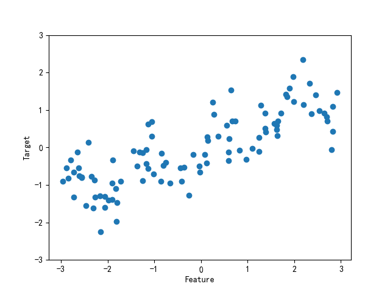

# ch02

## 一些样本数据集
一个模拟的二分类数据集示例是forge 数据集，它有两个特征。下列代码将绘制一个散点，将此数据集的所有数据点可视化。图像以第一个特征为x 轴，第二个特征为y 轴。正如其他散点图那样，每个数据点对应图像中的一点。每个点的颜色和形状对应其类别：
```python
# 分类数据集
X, y = make_forge()
mglearn.discrete_scatter(X[:, 0], X[:, 1], y)
plt.legend(['Class 0', 'Class 1'], loc=4)
plt.savefig("forge.png")
plt.show()
```


我们用模拟的wave 数据集来说明回归算法。wave 数据集只有一个输入特征和一个连续的目标变量（或响应），后者是模型想要预测的对象。下面绘制的图像（图2-3）中单一特征位于x 轴，回归目标（输出）位于y 轴：

```python
# 回归数据集
X, y = make_wave()  # X.shape(100, 1)
plt.plot(X, y, "o")
plt.ylim(-3, 3)
plt.xlabel("Feature")
plt.ylabel("Target")
plt.savefig("wave.png")
plt.show()
```


除了上面这些小型的模拟的数据集，我们还将补充两个现实世界中的数据集，它们都包含在scikit-learn 中。其中一个是威斯康星州乳腺癌数据集（简称cancer），里面记录了乳腺癌肿瘤的临床测量数据。每个肿瘤都被标记为“良性”（benign，表示无害肿瘤）或“恶性”（malignant，表示癌性肿瘤），其任务是基于人体组织的测量数据来学习预测肿瘤是否为恶性。
```python
# cancer数据集
cancer = load_breast_cancer()
print("key of cancer:\n{}".format(cancer.keys()))
# dict_keys(['data', 'target', 'frame', 'target_names', 'DESCR', 'feature_names', 'filename'])
print("shape of data:{}".format(cancer.data.shape))# shape of data:(569, 30)
print("sample counts per class:\n{}".format({n: v for n, v in zip(cancer.target_names, np.bincount(cancer.target))}))# {'malignant': 212, 'benign': 357}
print("feature names:\n{}".format(cancer.feature_names))#  30个
```

我们还会用到一个现实世界中的回归数据集，即波士顿房价数据集。与这个数据集相关的任务是，利用犯罪率、是否邻近查尔斯河、公路可达性等信息，来预测20 世纪70 年代波士顿地区房屋价格的中位数。这个数据集包含506 个数据点和13 个特征：

```python
# boston
boston = load_boston()
print("data shape: {}".format(boston.data.shape))  # data shape: (506, 13)

X, y = load_extended_boston()
# 最初的13个特征加上这13个特征两两组合（有放回）得到的91个特征，一共有104个特征
print("X.shape: {}".format(X.shape))  # X.shape: (506, 104)
```

## K近邻

构建模型只需要保存训练数据集即可。想要对新数据点做出预测，算法会在训练数据集中找到最近的数据点，也就是它的“最近邻”。

### k近邻分类
k-NN 算法最简单的版本只考虑一个最近邻，也就是与我们想要预测的数据点最近的训练数据点。预测结果就是这个训练数据点的已知输出。图给出了这种分类方法在forge数据集上的应用：


这里我们添加了3个新数据点（用五角星表示）。对于每个新数据点，我们标记了训练集中与它最近的点。单一最近邻算法的预测结果就是那个点的标签（对应五角星的颜色）。

除了仅考虑最近邻，我还可以考虑任意个（k 个）邻居。这也是k 近邻算法名字的来历。在考虑多于一个邻居的情况时，我们用“投票法”（voting）来指定标签。也就是说，对于每个测试点，我们数一数多少个邻居属于类别0，多少个邻居属于类别1。然后将出现次数更多的类别（也就是k 个近邻中占多数的类别）作为预测结果。下面的例子（图2-5）用到了3 个近邻.


和上面一样，预测结果可以从五角星的颜色看出。你可以发现，左上角新数据点的预测结果与只用一个邻居时的预测结果不同。虽然这张图对应的是一个二分类问题，但方法同样适用于多分类的数据集。对于多分类问题，我们数一数每个类别分别有多少个邻居，然后将最常见的类别作为预测结果。


```python
X, y = make_forge()
X_train, X_test, y_train, y_test = train_test_split(X, y)
clf = KNeighborsClassifier(n_neighbors=3)
clf.fit(X_train, y_train)

print("test set predictions: {}".format(clf.predict(X_test)))  # test set predictions: [0 1 0 1 0 0 1]
print("test set accuracy: {:.2f}".format(clf.score(X_test, y_test)))  # test set accuracy: 1.00
```

### 分析KNeighborsClassifier
对于二维数据集，我们还可以在xy 平面上画出所有可能的测试点的预测结果。我们根据平面中每个点所属的类别对平面进行着色。这样可以查看决策边界（decision boundary），即算法对类别0 和类别1 的分界线。


随着邻居个数越来越多，决策边界也越来越平滑。更平滑的边界对应更简单的模型。换句话说，使用更少的邻居对应更高的模型复杂度（如图2-1 右侧所示），而使用更多的邻居对应更低的模型复杂度（如图2-1 左侧所示）。假如考虑极端情况，即邻居个数等于训练集中所有数据点的个数，那么每个测试点的邻居都完全相同（即所有训练点），所有预测结果也完全相同（即训练集中出现次数最多的类别）。

我们来研究一下能否证实之前讨论过的模型复杂度和泛化能力之间的关系。我们将在现实世界的乳腺癌数据集上进行研究。先将数据集分成训练集和测试集，然后用不同的邻居个数对训练集和测试集的性能进行评估。输出结果见图：

```python
cancer = load_breast_cancer()
X_train, X_test, y_train, y_test = train_test_split(cancer.data, cancer.target, stratify=cancer.target, random_state=66)
training_accuracy = []
test_accuracy = []
# n_neighbors取值从1到100
neighbors_settings = range(1, 100)
for n_neighbors in neighbors_settings:
    # 构建模型
    clf = KNeighborsClassifier(n_neighbors=n_neighbors)
    clf.fit(X_train, y_train)
    # 记录训练集精度
    training_accuracy.append(clf.score(X_train, y_train))
    # 记录泛化精度
    test_accuracy.append(clf.score(X_test, y_test))
plt.plot(neighbors_settings, training_accuracy, label="training accuracy")
plt.plot(neighbors_settings, test_accuracy, label="test accuracy")
plt.ylabel("Accuracy")
plt.xlabel("n_neighbors")
plt.legend()
plt.savefig("KNeighborsClassifier_cancer.png")
plt.show()
```

图像的x 轴是n_neighbors，y轴是训练集精度和测试集精度。虽然现实世界的图像很少有非常平滑的，但我们仍可以看出过拟合与欠拟合的一些特征。仅考虑单一近邻时，训练集上的预测结果十分完美。但随着邻居个数的增多，模型变得更简单，训练集精度也随之下降。单一邻居时的测试集精度比使用更多邻居时要低，这表示单一近邻的模型过于复杂。与之相反，当考虑100 个邻居时，模型又过于简单，性能甚至变得更差。最佳性能在中间的某处，邻居个数大约为6。不过最好记住这张图的坐标轴刻度。最差的性能约为88% 的精度，这个结果仍然可以接受。
#### k近邻回归
k 近邻算法还可以用于回归。我们还是先从单一近邻开始，这次使用wave 数据集。我们添加了3 个测试数据点，在x 轴上用绿色五角星表示。利用单一邻居的预测结果就是最近邻的目标值。

同样，也可以用多个近邻进行回归。在使用多个近邻时，预测结果为这些邻居的平均值


```python
X, y = make_wave(40)
X_train, X_test, y_train, y_test = train_test_split(X, y)
reg = KNeighborsRegressor(n_neighbors=3)
reg.fit(X_train, y_train)
print("test set predictions: \n{}".format(reg.predict(X_test)))
'''
[ 1.35804903 -0.55985738  0.86954488  1.27642323 -1.74816387  1.41843267
 -0.90441436  0.89609343  0.00297044 -1.26241359 -1.32225646 -0.78269398
  0.86954488 -0.66774248 -0.56715615 -1.49001759  0.86954488 -1.49001759
 -0.74969529  0.19425431 -0.81050346 -0.37311844 -1.49001759  0.85083228
  1.55516634]
'''
print("test set R^2: {:.2f}".format(reg.score(X_test, y_test)))# test set R^2: 0.70
```

我们还可以用score 方法来评估模型，对于回归问题，这一方法返回的是R2 分数。R2 分数也叫作决定系数，是回归模型预测的优度度量，位于0 到1 之间。R2 等于1 对应完美预测，R2 等于0 对应常数模型，即总是预测训练集响应（y_train）的平均值：
这里的分数是0.0.70，表示模型的拟合相对较好。

#### 分析KNeighborsRegressor

对于我们的一维数据集，可以查看所有特征取值对应的预测结果。为了便于绘图，我们创建一个由许多点组成的测试数据集：


从图中可以看出，仅使用单一邻居，训练集中的每个点都对预测结果有显著影响，预测结果的图像经过所有数据点。这导致预测结果非常不稳定。考虑更多的邻居之后，预测结果变得更加平滑，但对训练数据的拟合也不好。


